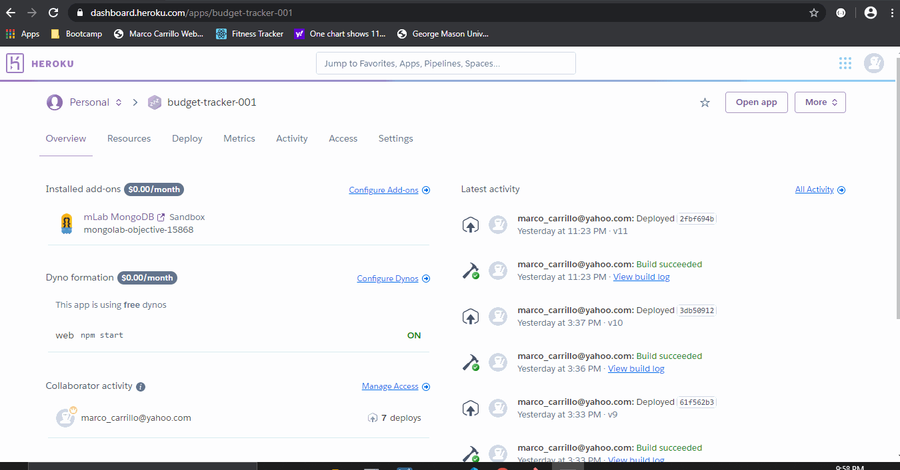

# Purpose of the application

The client-side and server-side functionality has been provided, so that we can create the functionality needed for the user to go offline and still be able to track expenses and have the application sync in with the server when the system goes back online.

Overall, this application allows the user to keep a log of all income and expenses to show the user the net cash position at any point in time (cash balance).

Each time the user wants to record a transaction, the user will provide the name of the transaction, the amount and whether it is a deposit or a withdrawal.  A deposit will increase the net cash position (balance) and a withdrawal will decrease it.

## Access and client application behavior

Application has been deployed to https://budget-tracker-001.herokuapp.com/

When the client application starts, the system will request from the server all known transactions via HTTP GET "/api/transaction".  That API will return all of the transactions, which will be taken by the broawer and will be displayed as both a table and a graph showing the balance over time.  The application does it by calling three functions:  populateTotal, populateTable and populateChart.

##  Adding offline capabilities 

To add offline capabilities, the system will install and activate a service worker program (/public/service-worker.js) that will monitor the interaction between the browser and the server, and will step in to retrieve data from two cashes to provide the latest known information available from the server.  Additionally, an indexdb table will be created so any new transactions can be stored while offline.  Finally, functionality will be added so that when the system is back online, transactions in the indexdb data can be sent to the server for permanent stogare in a MongoDB table.

##  Service worker

The service worker will create two caches, one with static data (all files it needs to run) and a data cache which will be storing the most recent transactions received from the server.

After creating and activating the service worker, service-worker.js will also do the following:

* It will install a listener for any fetch event.  If the URL contains the characters "/api/" and the response status is HTTP 200, then it will cache.  Checking for status avoids caching for failed api calls.

* It will make a HTTP GET /api/transaction call to the server, and will cache the results.  This ensures two things:  1) That we have the latest information, and 2) That we have data for the first ever transaction.  Since service worker is installed asynchronous, the system will call service-worker promise-based routines and will move to execute other work, like making an API call to get transactions and graphing them.  Most of the times, that API call was made before the service-worker was fully installed and activated.

## Main program functionality changes

We made the following changes to the program.

* It will first test if the system is offline.  If it is, it will check if there are temporary transactions.  If there are, it will make the api call that will be retrieved from the cache, and will add the temporary transactions to that list.  This happens, for example, when the user was previously offline and made transactions, and there have been no opportunities to upload the information.

* We added function prepareOfflineScenario, which will create a local table in case it is needed.

* The system will also check whether the system is online.  If so, it will check if there are transactions.  If there are, then it will send the server all of those temporary transactions via HTTP POST /api/transaction/bulk, and will delete them from the temporary table.

* Added functionality to the client, whenever a fetch transaction fails (server not online).  In that case, it will write a record in the temporary table.

## Progressive Application

This application can be installed as a progressive web application by any user that desires to do so.  In addition to installing a service worker, we have also installed a manifest.webmanifest that confirms to W3C working draft of March 19, 2020 (https://www.w3.org/TR/appmanifest/).

##  Server APIs

There are three servers APIs that will use Mongoose to manage the Mongo NOSQL collection.

1.  HTPP GET "/api/transaction":  Whenever this API route is called, it will return all records in the table sorted by most recently.

2.  HTTP POST "/api/transaction/bulk":  This API is called by the client to insert a list of temporary records into the Mongo NOSQL collection.

3.  HTTP POST "/api/transaction":  This API will create a new document in the MOngo NOSQL collection.  This API is used by the client whenever the server is available to add new transactions.

##  Overall application demonstration

